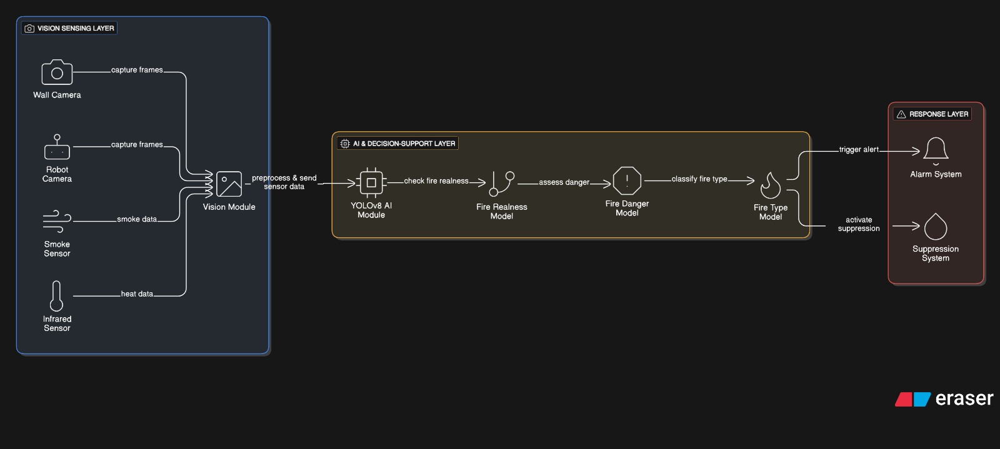

# 🚒 Smart AI-Driven Fire Detection & Suppression

A modular framework designed to bridge the gap between simple flame detection and intelligent, actionable response.

---

### /* System Architecture */
This diagram represents the three core layers of the system: **Vision Sensing**, **AI Decision Logic**, and **Active Response**.

---

### /* System Overview */
The proposed system integrates deep learning-based vision models (**YOLOv8**) with classical image processing and multi-sensor fusion. Unlike binary fire detectors, our logic evaluates:

1. **Temporal Persistence:** Analyzing bounding box growth over time to confirm a fire state.
2. **Spatial Localization:** Mapping visual coordinates to real-world coordinates for robotic nozzle targeting.
3. **Severity Assessment:** Estimating danger levels to trigger graduated response actions.

---

### /* Project Scope */
* **Perception:** Modular input from fixed security cameras or onboard robot cameras.
* **Intelligence:** Fire-state evaluation based on dynamic system behavior analysis.
* **Actuation:** Autonomous targeting using coordinate transformation and Inverse Kinematics (IK).