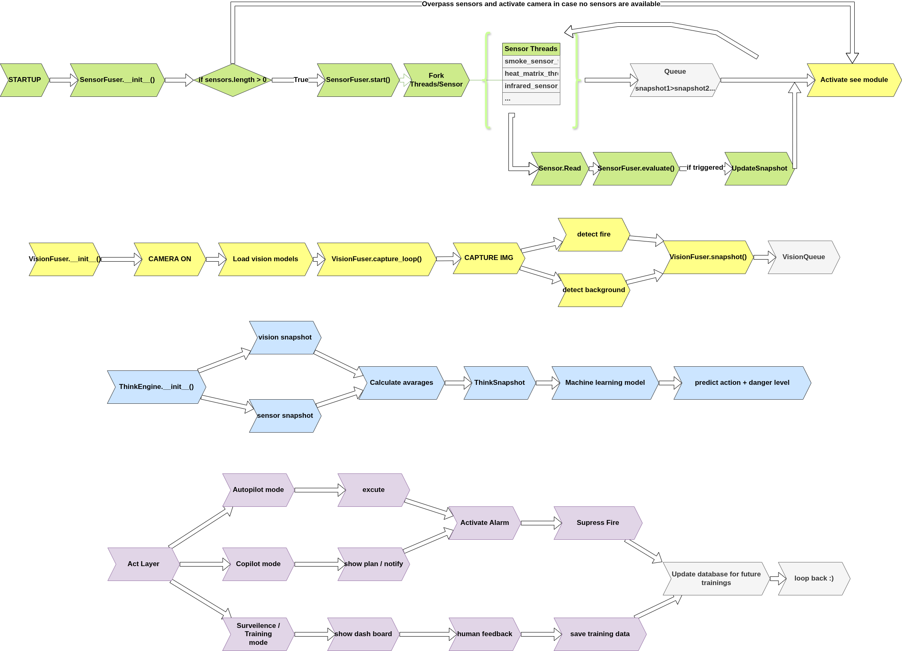
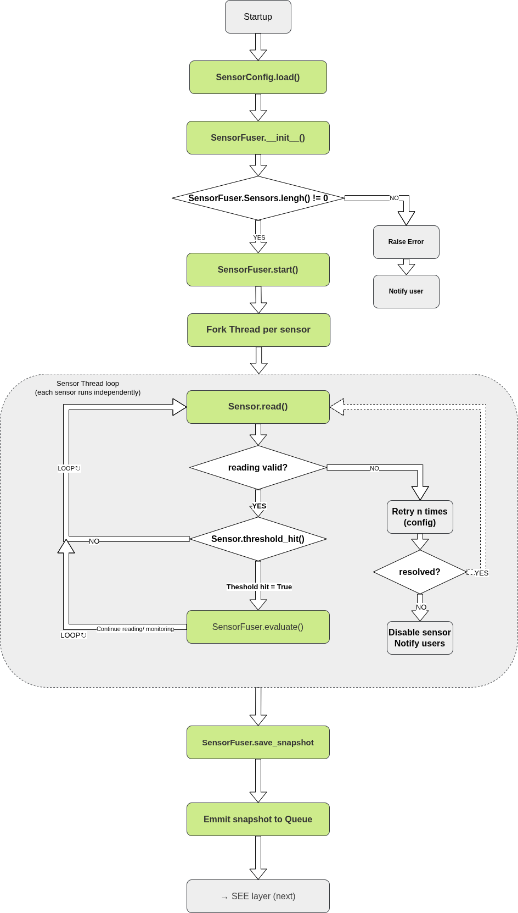
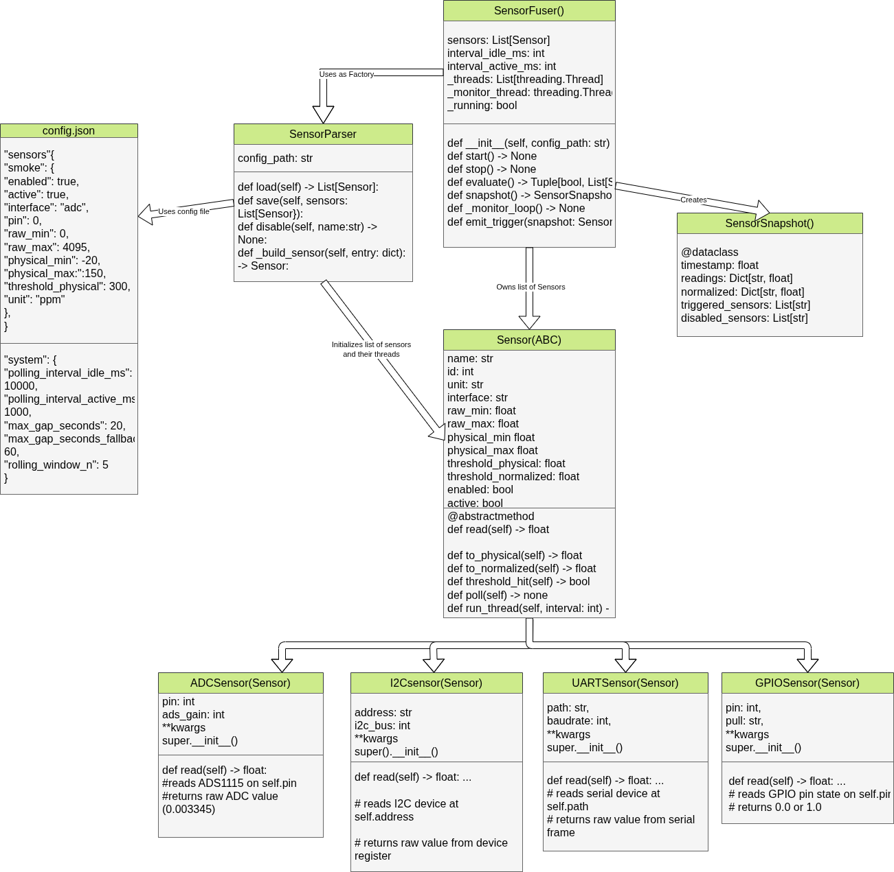
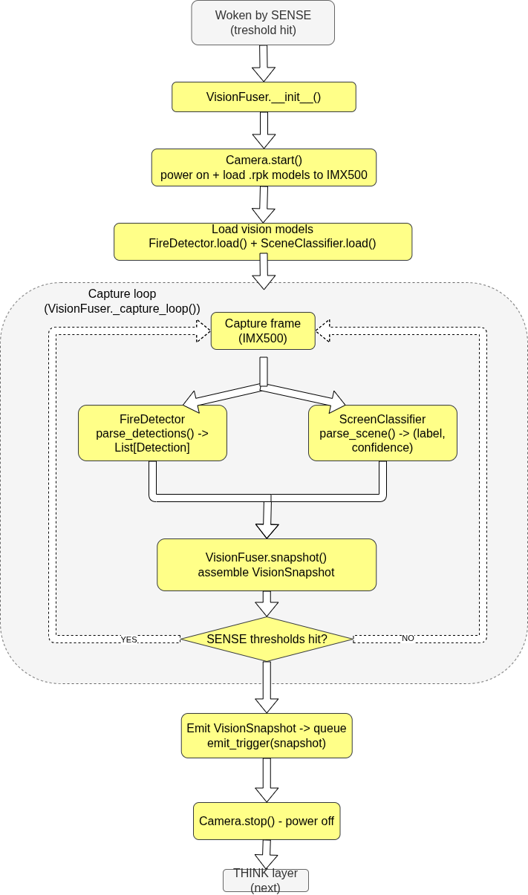
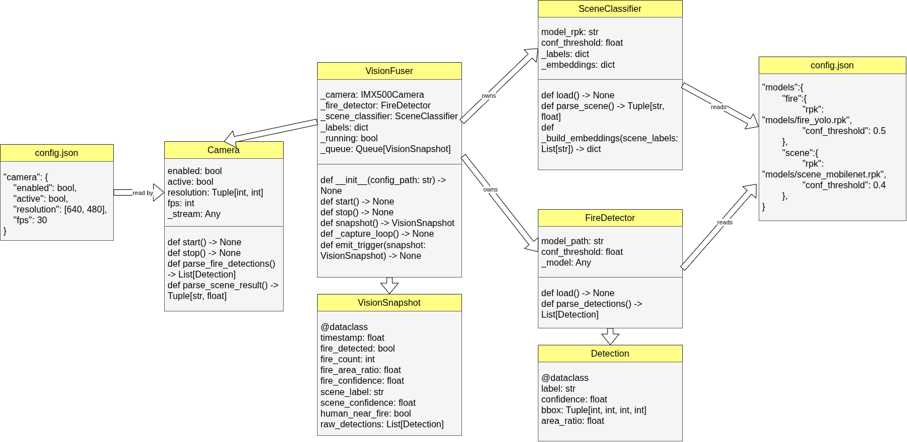
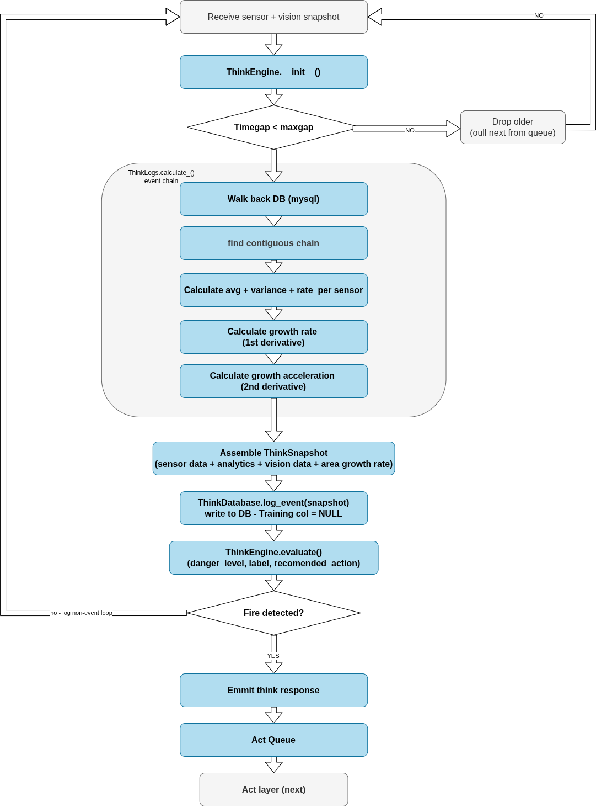
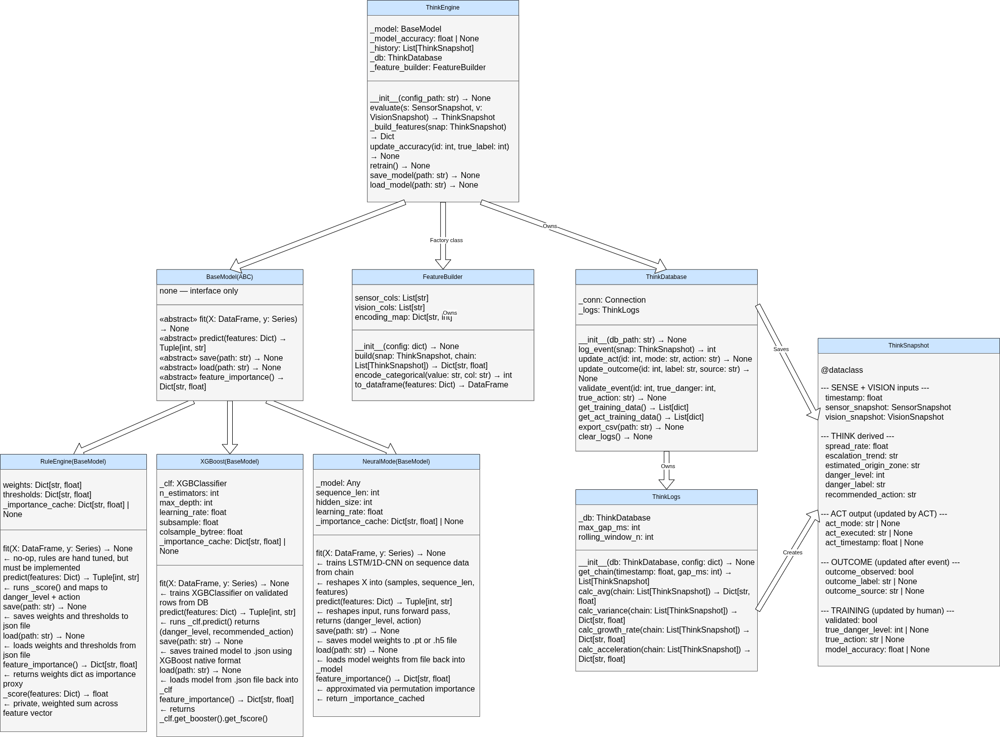
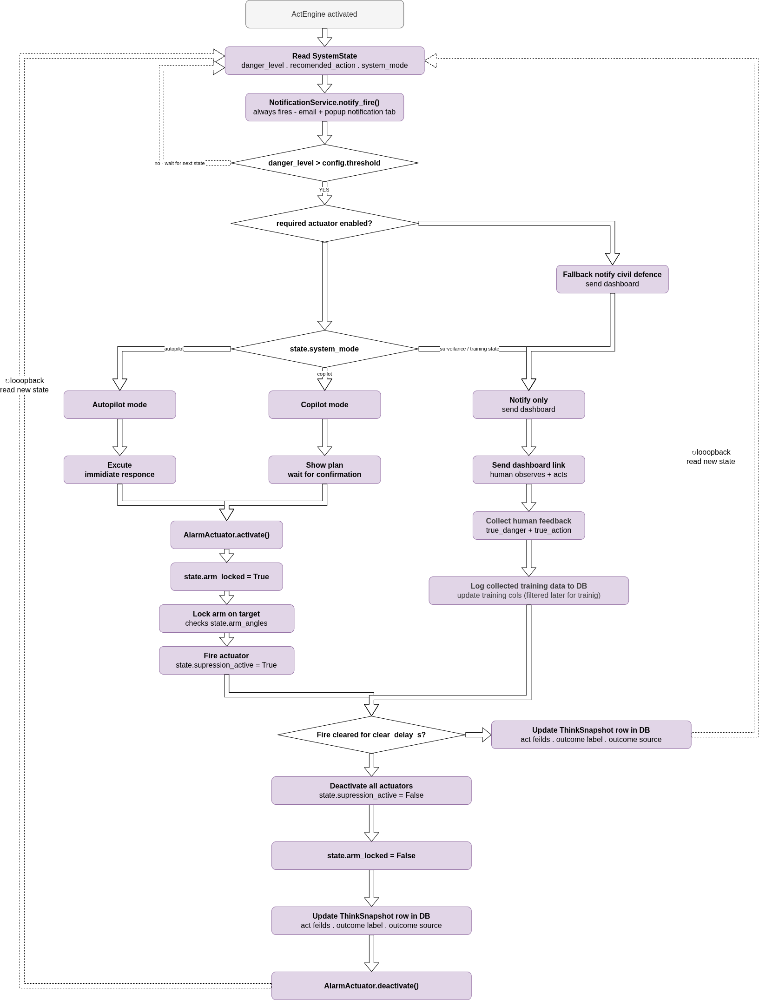
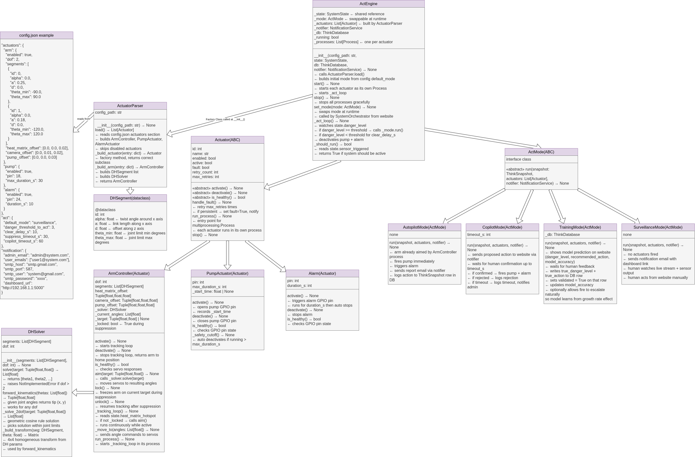

# Fire Detection and Response System — Architecture

**Version:** 0.1 (research prototype)  
**Status:** Implementation in progress  
**Author:** Maya Fakih  
**Database:** PostgreSQL — JSONB columns handle variable sensor configurations so schema stays fixed regardless of hardware setup.

---

## Table of Contents

1. [System Overview](#1-system-overview)
2. [System Pipeline](#2-system-pipeline)
3. [SystemOrchestrator and SystemState](#3-systemorchestrator-and-systemstate)
4. [SENSE Layer](#4-sense-layer)
5. [SEE Layer](#5-see-layer)
6. [THINK Layer](#6-think-layer)
7. [ACT Layer](#7-act-layer)
8. [Database Schema](#8-database-schema)
9. [Configuration Reference](#9-configuration-reference)
10. [Integration Contracts](#10-integration-contracts)
11. [Future Plans](#11-future-plans)
12. [Website and IoT Control](#12-website-and-iot-control)
13. [Module Reusability Boundary](#13-module-reusability-boundary)

---

## 1. System Overview

This system is a multi-layer intelligent fire detection and response platform designed for embedded deployment on a Raspberry Pi with attached sensors, camera module, and a 2-DOF robotic arm. It is capable of detecting fire using both physical sensors and computer vision, reasoning about the severity and growth rate of a detected event, and dispatching appropriate responses ranging from notification to physical suppression — all while continuously learning from human feedback to improve its decision-making over time.

The system is designed to be context-aware. Thresholds, actuator mappings, action spaces, and operating modes are all configurable through a single `config.json` file, allowing the same codebase to be deployed in a data centre (where any heat anomaly is critical) or a wildfire monitoring site (where much higher tolerances apply) without code changes.

The system is designed to be deployment-agnostic. It has no assumptions about its physical platform — it only knows what it sees through its camera and what its sensors report. Whether it is mounted on a fixed wall, a robotic arm, or a drone, the pipeline is identical. Physical platform awareness (spatial coordinates, movement, encoder feedback) is a future extension, not a core dependency.

The architecture is divided into four logical processing layers that run as independent operating system processes, coordinated through a shared state object managed by a `SystemOrchestrator`.

---

## 2. System Pipeline

The four layers form a left-to-right pipeline. Each layer produces a well-defined output that the next layer consumes. No layer reaches across layer boundaries except through these agreed contracts.

```
SENSE  ──►  SEE  ──►  THINK  ──►  ACT
```

| Layer | Color convention | Primary output |
|-------|-----------------|----------------|
| SENSE | Green | `SensorSnapshot` |
| SEE | Yellow | `VisionSnapshot` |
| THINK | Blue | `ThinkSnapshot` |
| ACT | Purple | DB row update + physical actuator commands |

### Top-level pipeline flowchart



> Note: This diagram shows the sequential boot order and hand-off points between layers. At runtime, all four layers operate concurrently as separate processes. The hand-offs happen through queues and shared state, not direct function calls.

---

## 3. SystemOrchestrator and SystemState

### 3.1 Role of the Orchestrator

The `SystemOrchestrator` is the entry point of the entire system. It is responsible for:

- Reading `config.json` at boot and extracting `system_mode`
- Creating the `multiprocessing.Manager` and constructing `SystemState`
- Instantiating all four layer components and passing them a reference to `SystemState`
- Calling `start()` on each component, which causes each to spawn its own operating system process
- Accepting mode change requests from the website and writing them to `SystemState`
- Shutting down all processes gracefully on system exit

The orchestrator does not manage the internal logic of any layer. It is a boot manager and a mode switcher. Each layer is self-managing: it reads `SystemState` in its own loop and decides independently whether to activate or deactivate based on the fields it watches.

Each layer that needs the database creates its own connection directly. SystemState does not mediate database access.

### 3.2 SystemState — the shared blackboard

**Design decision (day 6):** SystemState carries control signals only. Data travels between layers through typed snapshots in queues. Fields that belong to a single layer stay in that layer — they are not mirrored into SystemState.

`SystemState` wraps a `multiprocessing.Manager().dict()` so all OS processes share the same live values through the Manager server process. It also owns the three inter-layer queues.

A strict ownership rule applies: each field in `SystemState` has exactly one writer. No two processes write to the same field. This eliminates the need for mutexes and makes the concurrency model simple and deadlock-free.

| Field | Type | Written by | Read by |
|-------|------|-----------|---------|
| `sensor_triggered` | bool | SensorFuser | VisionFuser (wake-up signal) |
| `active_sensor_count` | int | SensorFuser | Orchestrator, NotificationService |
| `faulted_sensors` | List[str] | SensorFuser | NotificationService |
| `system_mode` | str | SystemOrchestrator | All layers |
| `system_running` | bool | SystemOrchestrator | All layers |
| `sense_running` | bool | SensorFuser | Orchestrator |
| `see_running` | bool | VisionFuser | Orchestrator |
| `think_running` | bool | ThinkEngine | Orchestrator |
| `act_running` | bool | ActEngine | Orchestrator |
| `camera_feed_active` | bool | SystemOrchestrator | VisionFuser |

**`camera_feed_active` rules:**
- Set to `True` only when the user explicitly opens the Camera Feed tab on the website. Never set automatically by threshold hits or any internal layer.
- Set to `False` when the user leaves the Camera Feed tab or closes the session.
- `SystemOrchestrator` is the sole writer — the website sends a request to the Flask backend which calls `SystemOrchestrator.set_camera_feed(active: bool)`.
- `VisionFuser` activates when **either** `sensor_triggered = True` **or** `camera_feed_active = True`. These are two independent wake-up conditions — sensor threshold triggers SEE for fire detection, camera feed request triggers SEE for live streaming. Both are valid reasons for SEE to run.

**Queues** — owned by SystemState, created at boot, never change:

| Queue | From | To |
|-------|------|----|
| `sense_queue` | SensorFuser | ThinkEngine |
| `see_queue` | VisionFuser | ThinkEngine |
| `think_queue` | ThinkEngine | ActEngine |

### 3.3 Process activation rules

Each layer watches its own relevant `SystemState` fields and activates or deactivates its internal work accordingly. The orchestrator does not need to tell them what to do.

| Process | Activates when | Deactivates when |
|---------|---------------|-----------------|
| SensorFuser | always on from boot | `system_running = False` |
| VisionFuser | `sensor_triggered = True` OR `camera_feed_active = True` | both `sensor_triggered = False` AND `camera_feed_active = False` |
| ThinkEngine | `sensor_triggered = True` AND snapshots available in queues | `sensor_triggered = False` |
| ActEngine | ThinkSnapshot received in `think_queue` | `system_running = False` |

> Note: VisionFuser serves two independent purposes — fire detection (woken by `sensor_triggered`) and live streaming (woken by `camera_feed_active`). When running in live stream mode only (sensor not triggered), VisionFuser captures frames and streams them to the website but does NOT emit `VisionSnapshot` to `see_queue` — THINK only processes when `sensor_triggered = True`.

### 3.4 Orchestrator flowchart


> This diagram is pending — will be added once the orchestrator design is finalised.

### 3.5 SystemOrchestrator class

```
SystemOrchestrator
  fields:
    state: SystemState
    sensor_fuser: SensorFuser
    vision_fuser: VisionFuser
    think_engine: ThinkEngine
    act_engine: ActEngine
    notification_service: NotificationService
    _processes: List[Process]

  methods:
    __init__(config_path: str) → None
    start() → None
    stop() → None
    set_mode(mode: str) → None
```

---

## 4. SENSE Layer

The SENSE layer is responsible for reading all physical sensors, validating their readings, detecting threshold crossings, and emitting `SensorSnapshot` objects to a queue for downstream consumption. It runs continuously from system boot and is the first layer to detect any environmental anomaly.

### 4.1 Flowchart



### 4.2 UML class diagram



### 4.3 Design principles

Every sensor type (ADC, I2C, UART, GPIO) inherits from a common abstract base class `Sensor`. This means the `SensorFuser` never needs to know what kind of sensor it is working with — it calls `poll()` on each one and they all behave identically from the outside.

`SensorParser` reads `config.json` at startup and constructs the correct concrete sensor subclass for each entry. This is the only place in the codebase where sensor types are branched on. After construction, all sensors are treated polymorphically.

Each sensor runs in its own thread inside the SensorFuser process, polling at the configured interval. The `SensorFuser` collects readings across all sensors and evaluates whether any threshold has been crossed. If one has, it assembles a `SensorSnapshot`, puts it in `sense_queue`, and writes `sensor_triggered = True` to `SystemState`, which wakes the SEE layer.

### 4.4 Fault handling

When a sensor produces an invalid reading (outside its configured `valid_min` / `valid_max` range, or a hardware read failure), the following sequence executes:

1. The sensor retries up to `max_retries` times (configured per sensor in `config.json`)
2. On each retry failure, the fault counter increments
3. If retries are exhausted, the sensor sets `fault = True` and removes itself from the active pool
4. SensorFuser updates `faulted_sensors` and `active_sensor_count` in SystemState
5. `NotificationService` is called immediately — email to admin, popup notification on website, persistent entry in the notification tab
6. `SensorFuser` continues operating with the remaining healthy sensors
7. The admin can re-enable the sensor from the website once the hardware issue is resolved

The system is designed to be tolerant of individual sensor failures because multiple sensor types are used in combination. The fire detection logic still functions correctly with a subset of sensors active.

### 4.5 Class definitions

**Sensor (ABC)**
```
fields:
  name: str
  id: int
  unit: str
  interface: str
  raw_min: float
  raw_max: float
  physical_min: float
  physical_max: float
  threshold_physical: float
  threshold_normalized: float
  enabled: bool
  active: bool
  latest_raw: float
  latest_physical: float
  triggered: bool
  retry_count: int
  max_retries: int
  valid_min: float
  valid_max: float
  fault: bool
  formula: str | None    # optional custom conversion expression (see 4.3 design principles)
                         # if None, linear fallback is used in to_physical()

methods:
  read() → float                       [abstract]
  to_physical() → float
    uses eval(formula, restricted_namespace) if formula is set
    fallback: physical_min + ((raw - raw_min) / (raw_max - raw_min)) * (physical_max - physical_min)
    restricted namespace exposes: raw, raw_min, raw_max, physical_min, physical_max only
    eval errors → logged to stderr, shown in Console & Logs, sensor deactivated
  to_normalized() → float
  threshold_hit() → bool
  is_valid(value: float) → bool
  handle_fault() → None
  poll() → None
  run_thread(interval: int) → None
  stop() → None
```

**ADCSensor(Sensor)**
```
fields:  pin: int, ads_gain: int
methods: read() → float
         reads ADS1115 on self.pin, returns raw ADC value
```

**I2CSensor(Sensor)**
```
fields:  address: str, i2c_bus: int
methods: read() → float
         reads I2C device at self.address
```

**UARTSensor(Sensor)**
```
fields:  path: str, baudrate: int
methods: read() → float
         reads serial device at self.path
```

**GPIOSensor(Sensor)**
```
fields:  pin: int, pull: str
methods: read() → float
         reads GPIO pin state, returns 0.0 or 1.0
```

**SensorFuser**
```
fields:
  sensors: List[Sensor]
  interval_idle_ms: int
  interval_active_ms: int
  _threads: List[Thread]
  _monitor_thread: Thread
  _running: bool

methods:
  __init__(config_path: str) → None
  start() → None
  stop() → None
  evaluate() → Tuple[bool, List[Sensor]]
  snapshot() → SensorSnapshot
  _monitor_loop() → None
  emit_trigger(snapshot: SensorSnapshot) → None
  wake_see() → None
```

**SensorSnapshot (dataclass)**
```
fields:
  timestamp: float
  readings: Dict[str, float]            # sensor_name → physical value (scalar, always populated)
  normalized: Dict[str, float]          # sensor_name → 0.0–1.0
  triggered_sensors: List[str]          # names of sensors above threshold
  disabled_sensors: List[str]           # names of sensors currently faulted
  raw_matrices: Dict[str, List[float]]  # sensor_name → flat grid, only for matrix sensors
                                        # empty dict {} if no matrix sensors present
                                        # shape defined in config per sensor e.g. "matrix_shape": [4, 4]
                                        # always populated on every snapshot regardless of trigger state
```

**SensorParser**
```
fields:  config_path: str
methods:
  load() → List[Sensor]
    validates each sensor entry before building
    skips and deactivates sensors with missing required fields
    logs all validation failures to stderr and Console & Logs
    returns only valid, enabled sensors
  save(sensors: List[Sensor]) → None
  disable(name: str) → None
  _build_sensor(entry: dict) → Sensor
    factory method — branches on entry["interface"]
    returns ADCSensor | I2CSensor | UARTSensor | GPIOSensor
  _validate(entry: dict) → bool
    checks all required fields are present and of correct type
    logs specific missing field to stderr if validation fails
```

### 4.6 Relationships

```
SensorParser     ── uses once at init ──►  Sensor objects (factory)
SensorFuser      ──◆ owns ──────────────►  List[Sensor]
SensorFuser      ──◆ uses ──────────────►  SensorParser (at init only)
SensorFuser      ── creates ────────────►  SensorSnapshot
ADCSensor        ── inherits ───────────►  Sensor (ABC)
I2CSensor        ── inherits ───────────►  Sensor (ABC)
UARTSensor       ── inherits ───────────►  Sensor (ABC)
GPIOSensor       ── inherits ───────────►  Sensor (ABC)
```

### 4.7 Config reference (SENSE section)

```json
"sensors": {
  "smoke": {
    "enabled": true,
    "active": true,
    "interface": "adc",
    "pin": 0,
    "raw_min": 0,
    "raw_max": 4095,
    "physical_min": 0,
    "physical_max": 1000,
    "threshold_physical": 300,
    "unit": "ppm",
    "valid_min": 0,
    "valid_max": 1000,
    "max_retries": 3
  },
  "heat_matrix": {
    "enabled": true,
    "active": true,
    "interface": "i2c",
    "address": "0x69",
    "i2c_bus": 1,
    "raw_min": 0,
    "raw_max": 655.35,
    "physical_min": -20,
    "physical_max": 300,
    "threshold_physical": 60,
    "unit": "celsius",
    "valid_min": -20,
    "valid_max": 300,
    "max_retries": 3,
    "matrix_shape": [4, 4]
  }
},
"system": {
  "polling_interval_idle_ms": 10000,
  "polling_interval_active_ms": 1000,
  "max_gap_seconds": 20,
  "max_gap_seconds_fallback": 60,
  "rolling_window_n": 5
}
```

**Notes on config fields:**
- `formula` is optional. If omitted, `to_physical()` uses the default linear mapping. Specify only when the sensor requires a custom conversion e.g. `"formula": "physical_min + ((raw - raw_min) / (raw_max - raw_min)) * (physical_max - physical_min) + 5"`. Available variables in the formula string: `raw`, `raw_min`, `raw_max`, `physical_min`, `physical_max`.
- `matrix_shape` is required for matrix sensors only. Tells `SensorFuser` how to reshape the flat list from `read()` when building `raw_matrices` in the snapshot.
- If any required field is missing, `SensorParser` skips the sensor, logs the specific missing field to `stderr`, and shows the error in Console & Logs on the website.

---

## 5. SEE Layer

The SEE layer is responsible for all computer vision processing. It is powered off when sensors are below threshold and activates explicitly when `SensorFuser` writes `sensor_triggered = True` to `SystemState`. The camera and all vision models are loaded only when needed, which reduces power consumption and extends hardware lifespan.

The IMX500 camera module performs inference on-chip using pre-loaded `.rpk` model packages. Two models run in parallel on each captured frame: a YOLO-based fire detector and a scene classifier for background awareness.

FireDetector — uses a fine-tuned YOLO model (.rpk package loaded to the IMX500 chip) trained specifically on fire detection. Jana is training this now. Output is bounding boxes with confidence scores.

SceneClassifier — uses MobileNetV3 as the backbone, loaded as a .rpk package to the same IMX500 chip. It classifies the background scene (kitchen, warehouse, server room, etc.) to give THINK context about the environment the fire is in.

### 5.1 Flowchart



### 5.2 UML class diagram



### 5.3 Design principles

`FireDetector` and `SceneClassifier` both inherit from `VisionModel(ABC)`, which defines the `load()` interface. This means both models are interchangeable as far as `VisionFuser` is concerned — new model types can be introduced without changing the fuser.

`VisionFuser` owns the camera, both models, and the output queue. It runs a continuous capture loop while active, feeding each frame through both models in parallel, and assembling the results into a `VisionSnapshot`.

`FireDetector.parse_detections()` processes the raw YOLO output externally — no YOLO internals are accessed. For each detected box it reads the class index, maps it to a label name via `results[0].names`, and reads the winning confidence score. All box data is then grouped by label and passed to the cluster builder.

The clustering algorithm groups spatially proximate fire and smoke boxes into `FireCluster` objects. Boxes are considered part of the same cluster if their centroids are within a configurable proximity threshold. Each cluster captures the union of its fire and smoke boxes, computes the predicted fire origin as the centroid of that union, and identifies the primary detection as the highest-danger box (ranked by `primary_confidence × total_area_ratio`). Clusters are sorted descending by the same danger score — index 0 is always the most dangerous.

The `human_near_fire` field on `VisionSnapshot` is derived, not directly from a model. It is computed by checking whether any detection in `raw_detections` has a label in the configured `human_labels` list while `fire_detected` is also true.

The `composite_label` field is a string enum constructed by `FireDetector` from the cluster list: `"fire-smoke"` if the dominant cluster has both, `"fire"` if fire only, `"smoke"` if smoke only, `"none"` if no clusters. This string is used directly in human-facing notifications. `FeatureBuilder` encodes it to an integer for XGBoost.

A reference to the captured frame image is stored as `frame_image_url` in the snapshot. The image itself is saved to the configured storage backend (local filesystem path, Google Drive, S3, or any URL-addressable store). The system only stores the URL — it does not care where the image lives. This reference is included in all human notifications so the recipient can see exactly what the camera captured at the moment of detection.

### 5.4 Class definitions

**VisionModel (ABC)**
```
fields:  model_rpk: str, conf_threshold: float
methods: load() → None  [abstract]
```

**FireDetector(VisionModel)**
```
methods:
  load() → None
  parse_detections(results) → Tuple[List[Detection], List[FireCluster]]
    reads results[0].boxes externally — no YOLO internals accessed
    groups boxes by label, builds clusters, sorts by danger score
  _build_clusters(detections: List[Detection]) → List[FireCluster]
    proximity-based grouping of fire and smoke boxes
    computes union areas (overlap-corrected), origin centroid, danger score
  _danger_score(cluster: FireCluster) → float
    primary_confidence × total_area_ratio
```

**SceneClassifier(VisionModel)**
```
fields:
  _labels: dict
  _embeddings: dict

methods:
  load() → None
  parse_scene() → Tuple[str, float]
  _build_embeddings(scene_labels: List[str]) → dict
    runs once at startup, never at inference time
```

**IMX500Camera**
```
fields:
  enabled: bool
  active: bool
  resolution: Tuple[int, int]
  fps: int
  _stream: Any

methods:
  start() → None      powers on, loads .rpk packages to chip
  stop() → None       powers off completely
  capture_frame() → Any
  parse_fire_detections() → List[Detection]
  parse_scene_result() → Tuple[str, float]
```

**Detection (dataclass)**
```
fields:
  label: str
  confidence: float
  bbox: Tuple[int, int, int, int]    x, y, w, h in pixels
  area_ratio: float
```

**FireCluster (dataclass)**
```
fields:
  cluster_id: int
  origin_x: float                    centroid x of fire+smoke union bbox
  origin_y: float                    centroid y of fire+smoke union bbox
  total_area_ratio: float            union of all boxes in cluster / frame area
  fire_area_ratio: float             fire boxes union only / frame area
  smoke_area_ratio: float            smoke boxes union only / frame area
  primary_label: str                 label of highest danger-score box
  primary_confidence: float
  primary_bbox: Tuple[int,int,int,int]
  box_count: int                     total boxes grouped into this cluster
  has_fire: bool
  has_smoke: bool

note:
  danger_score = primary_confidence × total_area_ratio
  clusters are sorted descending by danger_score
  cluster index 0 is always the most dangerous
  serialises to JSONB in the database
```

**VisionSnapshot (dataclass)**
```
fields:
  timestamp: float

  --- scene classifier ---
  scene_label: str                   from labels.json scene_labels
  scene_confidence: float

  --- composite assessment ---
  composite_label: str               "fire-smoke" | "fire" | "smoke" | "none"
                                     human-readable, used directly in notifications
                                     FeatureBuilder encodes to int for XGBoost
  glimpsed_fire: bool                True if any fire box existed, even below threshold
  human_near_fire: bool              derived: fire detected AND human label present

  --- frame-level totals ---
  fire_count: int                    boxes above threshold
  smoke_count: int                   boxes above threshold
  fire_union_area: float             overlap-corrected union of all fire boxes
  smoke_union_area: float            overlap-corrected union of all smoke boxes

  --- clusters ---
  cluster_count: int
  dominant_cluster_idx: int          always 0 — highest danger_score cluster
  fire_clusters: List[FireCluster]   ordered by danger_score descending
                                     serialises to JSONB in the database

  --- image reference ---
  frame_image_url: str               URL or path to the captured frame image
                                     storage backend is configurable (local, Drive, S3)
                                     included in all human notifications

  --- raw output ---
  raw_detections: List[Detection]    everything YOLO returned, unmodified
                                     serialises to JSONB in the database
```

**VisionFuser**
```
fields:
  _camera: IMX500Camera
  _fire_detector: FireDetector
  _scene_classifier: SceneClassifier
  _labels: dict
  _running: bool
  _queue: Queue[VisionSnapshot]

methods:
  __init__(config_path: str) → None
  start() → None
  stop() → None
  snapshot() → VisionSnapshot
  _capture_loop() → None
  emit_trigger(snapshot: VisionSnapshot) → None
```

### 5.5 Relationships

```
VisionModel (ABC)  ◄── inherits ──  FireDetector
VisionModel (ABC)  ◄── inherits ──  SceneClassifier
VisionFuser        ──◆ owns ──────► IMX500Camera
VisionFuser        ──◆ owns ──────► FireDetector
VisionFuser        ──◆ owns ──────► SceneClassifier
VisionFuser        ── creates ───►  VisionSnapshot
FireDetector       ── creates ───►  Detection
FireDetector       ── creates ───►  FireCluster
VisionSnapshot     ── contains ──►  List[FireCluster]
VisionSnapshot     ── contains ──►  List[Detection]
config.json        ── configures ►  VisionFuser (at init)
config.json        ── configures ►  FireDetector (model path, threshold, proximity_threshold)
config.json        ── configures ►  SceneClassifier (model path, threshold)
labels.json        ── read by ───►  VisionFuser, SceneClassifier
```

### 5.6 Config reference (SEE section)

```json
"vision": {
  "camera": {
    "enabled": true,
    "active": false,
    "resolution": [640, 480],
    "fps": 30
  },
  "models": {
    "fire": {
      "rpk": "models/fire_yolo.rpk",
      "conf_threshold": 0.5,
      "glimpse_threshold": 0.2,
      "proximity_threshold": 80
    },
    "scene": {
      "rpk": "models/scene_mobilenet.rpk",
      "conf_threshold": 0.4
    }
  },
  "storage": {
    "frame_image_backend": "local",
    "frame_image_path": "frames/",
    "frame_image_url_prefix": "http://192.168.1.1:5000/frames/"
  },
  "labels": "configs/labels.json"
}
```

**labels.json**
```json
{
  "scene_labels": ["classroom", "hospital", "kitchen", "warehouse",
                   "office", "server_room", "corridor", "parking_garage"],
  "human_labels": ["person", "child", "crowd"]
}
```

---

## 6. THINK Layer

The THINK layer is the analytical core of the system. It receives aligned `SensorSnapshot` and `VisionSnapshot` pairs, computes derived time-series metrics across a contiguous event chain retrieved from the database, assembles a `ThinkSnapshot`, logs it, runs the machine learning model to produce a danger assessment, and emits the result to the ACT layer.

THINK always executes the same pipeline regardless of operating mode. The mode branching happens in ACT. THINK's only job is to reason about the world accurately and completely.

### 6.1 Flowchart



### 6.2 UML class diagram



### 6.3 Timestamp alignment

THINK receives `SensorSnapshot` and `VisionSnapshot` from their respective queues. Before processing, it checks whether the timestamps of the two snapshots are within `max_gap_ms` of each other (configured in `config.json`). If the gap is too large, the older snapshot is dropped and the next one is pulled from that queue. Anything older than the chosen pair is discarded from RAM immediately to prevent memory growth. Once an aligned pair is found, processing proceeds.

### 6.4 Event chain calculation — ThinkLogs

The most important computation in THINK is the event chain analysis performed by `ThinkLogs`. Rather than reasoning only about the current snapshot in isolation, THINK looks back through the database and collects all recent snapshots that belong to the same continuous event — defined as snapshots where the time gap between consecutive entries does not exceed `max_gap_ms`.

For example, if snapshots arrive at timestamps 1.0, 0.9, 0.8, 0.7, 0.6, 0.2 (seconds ago) and `max_gap_ms` is 150ms, the chain includes 1.0 through 0.6 and stops — the gap between 0.6 and 0.2 exceeds the threshold, meaning they belong to separate events.

For this event chain, `ThinkLogs` calculates the following for each sensor reading and each vision field:

- **Average** across the chain
- **Variance** across the chain
- **Growth rate** (first derivative) — how fast the value is changing
- **Acceleration** (second derivative) — how fast the growth rate itself is changing

For the vision outputs, growth rate and acceleration are computed over `dominant cluster total_area_ratio`, `fire_union_area`, `smoke_union_area`, `primary_confidence`, and `origin_x` / `origin_y` of the dominant cluster. These time-series derivatives are what allow the model to distinguish a stable candle from an accelerating fire — two events that may look identical in a single snapshot but are completely different across a chain.

### 6.5 Machine learning architecture

The model is designed to be swappable behind a single `BaseModel` interface. Three phases are planned:

**Phase 1 — RuleEngine** (day one, no training data required)  
A hand-tuned weighted scoring function across the feature vector. Weights and thresholds are stored in a JSON file and are editable from the website by an admin. This phase allows the system to be deployed and useful immediately.

**Phase 2 — XGBoostModel** (once approximately 200 validated rows exist in the database)  
An `XGBClassifier` trained on validated `ThinkSnapshot` rows. Predicts both `danger_level` (1–5) and `recommended_action` as separate classification heads. Handles mixed numeric and encoded categorical features well, produces interpretable feature importance scores, and runs fast on embedded hardware.

**Phase 3 — NeuralModel** (if XGBoost cannot capture temporal patterns sufficiently)  
A small LSTM or 1D-CNN operating over the chain sequence directly, capturing the shape of how readings evolve over time rather than just their current statistics.

All three implement the same `BaseModel(ABC)` interface. Swapping from phase 1 to phase 2 is done by changing one line in `config.json` and triggering a retrain from the website.

**Phase 4 — ModelEvaluator** (planned, not yet defined)  
A ModelEvaluator class is planned as an offline diagnostic tool that runs against exported validated data from ThinkDatabase. It will benchmark model implementations against each other before any model is promoted to the live system on the Pi. It lives at `think/ml/evaluator.py` and is never imported by the live pipeline. Design is pending and will be defined once sufficient validated training data exists to make evaluation meaningful.

### 6.6 Feature vector

`FeatureBuilder` takes a `ThinkSnapshot` plus its event chain and flattens everything into a single dictionary of floats that the model can consume directly. The `ThinkSnapshot` stores human-readable structured data. The feature vector is the model's flat numeric representation of the same information.

For each sensor, the feature vector includes: `latest_normalized`, `avg_over_chain`, `variance_over_chain`, `growth_rate`, `acceleration`.

For vision outputs — dominant cluster only (index 0):
`composite_label` (encoded to int: 0=none, 1=smoke, 2=fire, 3=fire-smoke),
`glimpsed_fire` (0/1), `human_near_fire` (0/1),
`fire_count`, `smoke_count`, `cluster_count`,
`fire_union_area`, `smoke_union_area`,
`dominant_total_area_ratio`, `dominant_fire_area_ratio`, `dominant_smoke_area_ratio`,
`dominant_primary_confidence`, `dominant_origin_x`, `dominant_origin_y`,
`dominant_has_fire` (0/1), `dominant_has_smoke` (0/1),
`dominant_area_growth_rate`, `dominant_area_acceleration`,
`dominant_origin_x_growth_rate`, `dominant_origin_y_growth_rate`,
`scene_label` (encoded to int).

`cluster_count` is included so the model is aware when multiple fires exist even though only the dominant cluster is fully represented in the feature vector. Multi-fire feature expansion is a future extension.

For derived fields: `escalation_trend` (encoded), `estimated_origin_zone` (encoded), `chain_length`.

Available actuators are also encoded as binary features so the model knows what tools it has when recommending an action. It will never recommend water suppression if that feature is always zero in training data.

### 6.7 ThinkSnapshot structure

`ThinkSnapshot` is a single dataclass that accumulates data from all four layers over the lifecycle of one event. It starts with SENSE and SEE inputs, gets THINK-derived fields added when assembled, gets ACT fields added when action is taken, gets outcome fields added when the fire is resolved, and gets training fields added if a human validates it.

```
--- INPUTS ---
timestamp: float
sensor_snapshot: SensorSnapshot
vision_snapshot: VisionSnapshot

--- THINK DERIVED ---
spread_rate: float
escalation_trend: str              WORSENING | STABLE | IMPROVING
estimated_origin_zone: str         TOPLEFT | TOPRIGHT | CENTER | etc.
danger_level: int                  1 through 5
danger_label: str
recommended_action: str

--- ACT OUTPUT (written by ACT after execution) ---
act_mode: str | None
act_executed: str | None
act_timestamp: float | None

--- OUTCOME (written after event resolves) ---
outcome_observed: bool
outcome_label: str | None          CONTAINED | ESCALATED | FALSE_ALARM
outcome_source: str | None         HUMAN | SENSOR_CLEARANCE | TIMEOUT

--- TRAINING (written by human in training mode) ---
validated: bool
true_danger_level: int | None
true_action: str | None
model_accuracy: float | None
```

One row in the database corresponds to one `ThinkSnapshot`. THINK creates it and writes the first set of fields. ACT updates the same row with execution details. The outcome is written when the event resolves. Human validators write the training fields. This makes the database the single source of truth for the complete lifecycle of every detected event.

### 6.8 Danger level scale

| Level | Label | Meaning |
|-------|-------|---------|
| 1 | MINIMAL | Logged only, no notification |
| 2 | LOW | Single notification, 15-minute reminder |
| 3 | MODERATE | Notification, ACT enters monitoring state |
| 4 | HIGH | Immediate notification, ACT executes response |
| 5 | CRITICAL | Continuous notification, full ACT response |

The threshold at which ACT activates physical actuators is configurable in `config.json` (`danger_threshold_to_act`). In a data centre this might be set to 2. In a wildfire monitoring context it might be set to 4.

### 6.9 Class definitions

**ThinkEngine**
```
fields:
  _model: BaseModel
  _model_accuracy: float | None
  _history: List[ThinkSnapshot]
  _db: ThinkDatabase
  _feature_builder: FeatureBuilder

methods:
  __init__(config_path: str) → None
  evaluate(s: SensorSnapshot, v: VisionSnapshot) → ThinkSnapshot
  _build_features(snap: ThinkSnapshot) → Dict
  update_accuracy(id: int, true_label: int) → None
  retrain() → None
  save_model(path: str) → None
  load_model(path: str) → None
```

**ThinkDatabase**
```
fields:
  _conn: Connection
  _logs: ThinkLogs

methods:
  __init__(db_path: str) → None
  log_event(snap: ThinkSnapshot) → int
  update_act(id: int, mode: str, action: str) → None
  update_outcome(id: int, label: str, source: str) → None
  validate_event(id: int, true_danger: int, true_action: str) → None
  get_training_data() → List[dict]       SELECT WHERE validated = 1
  get_act_training_data() → List[dict]   SELECT WHERE outcome_label IS NOT NULL
  export_csv(path: str) → None
  clear_logs() → None
```

**ThinkLogs**
```
fields:
  _db: ThinkDatabase
  max_gap_ms: int
  rolling_window_n: int

methods:
  __init__(db: ThinkDatabase, config: dict) → None
  get_chain(timestamp: float, gap_ms: int) → List[ThinkSnapshot]
  calc_avg(chain: List[ThinkSnapshot]) → Dict[str, float]
  calc_variance(chain: List[ThinkSnapshot]) → Dict[str, float]
  calc_growth_rate(chain: List[ThinkSnapshot]) → Dict[str, float]
  calc_acceleration(chain: List[ThinkSnapshot]) → Dict[str, float]
```

**FeatureBuilder**
```
fields:
  sensor_cols: List[str]
  vision_cols: List[str]
  encoding_map: Dict[str, int]

methods:
  __init__(config: dict) → None
  build(snap: ThinkSnapshot, chain: List[ThinkSnapshot]) → Dict[str, float]
  encode_categorical(value: str, col: str) → int
  to_dataframe(features: Dict) → DataFrame
```

**BaseModel (ABC)**
```
fields:
  _importance_cache: Dict[str, float] | None

methods:
  fit(X: DataFrame, y: Series) → None            [abstract]
  predict(features: Dict) → Tuple[int, str]      [abstract]
  save(path: str) → None                         [abstract]
  load(path: str) → None                         [abstract]
  feature_importance() → Dict[str, float]        [abstract]
```

**RuleEngine(BaseModel)**
```
fields:
  weights: Dict[str, float]
  thresholds: Dict[str, float]
  _importance_cache: Dict[str, float] | None

methods:
  fit(X, y) → None              no-op, rules are hand-tuned
  predict(features) → Tuple[int, str]
  save(path: str) → None        writes weights + thresholds to JSON
  load(path: str) → None        reads weights + thresholds from JSON
  feature_importance() → Dict   returns weights dict as importance proxy
  _score(features: Dict) → float
```

**XGBoostModel(BaseModel)**
```
fields:
  _clf: XGBClassifier
  n_estimators: int
  max_depth: int
  learning_rate: float
  subsample: float
  colsample_bytree: float
  _importance_cache: Dict[str, float] | None

methods:
  fit(X, y) → None              trains on validated DB rows
  predict(features) → Tuple[int, str]
  save(path: str) → None        XGBoost native .json format
  load(path: str) → None
  feature_importance() → Dict   get_booster().get_fscore(), cached after fit
```

**NeuralModel(BaseModel)**
```
fields:
  _model: Any
  sequence_len: int
  hidden_size: int
  learning_rate: float
  _importance_cache: Dict[str, float] | None

methods:
  fit(X, y) → None              trains LSTM/1D-CNN on chain sequence data
  predict(features) → Tuple[int, str]
  save(path: str) → None        .pt or .h5 file
  load(path: str) → None
  feature_importance() → Dict   permutation importance, cached after fit
```

### 6.10 THINK relationships

```
ThinkEngine      ──◆ owns ──────►  ThinkDatabase
ThinkEngine      ──◆ owns ──────►  FeatureBuilder
ThinkEngine      ── uses ────────►  BaseModel (swappable)
ThinkEngine      ── creates ────►  ThinkSnapshot
ThinkDatabase    ──◆ owns ──────►  ThinkLogs
ThinkDatabase    ── logs ────────►  ThinkSnapshot (updates same row)
ThinkLogs        ── queries ────►  ThinkDatabase
BaseModel (ABC)  ◄── inherits ──   RuleEngine
BaseModel (ABC)  ◄── inherits ──   XGBoostModel
BaseModel (ABC)  ◄── inherits ──   NeuralModel
ThinkSnapshot    ── contains ───►  SensorSnapshot
ThinkSnapshot    ── contains ───►  VisionSnapshot
```

---

## 7. ACT Layer

The ACT layer receives a `ThinkSnapshot` from THINK and executes an appropriate physical and notification response. It is the only layer that interacts with external hardware (GPIO pins, servos, network actuators) and external parties (admin and user notifications, website).

The operating mode (autopilot, copilot, surveillance, training) is a runtime-configurable parameter that controls the degree of human involvement in the response. All modes produce the same notifications. They differ only in whether physical actuators fire automatically, wait for human confirmation, or do not fire at all.

### 7.1 Orchestrator flowchart


> Pending — will be added once the orchestrator design is finalised.

### 7.2 ACT engine flowchart



### 7.3 UML class diagram



### 7.4 Operating modes

**Autopilot**  
The model's `recommended_action` is executed immediately without waiting for human input. A report email is sent after execution. This mode is appropriate for unattended deployments where the response hardware is trusted to act correctly.

**Copilot**  
The proposed action is displayed on the website dashboard and the system waits for human confirmation for up to `copilot_timeout_s` seconds. If the human confirms, the actuators fire. If rejected or timed out, the event is logged with the outcome recorded. This mode is appropriate when a human is available and monitoring the situation.

**Surveillance**  
No actuators fire under any circumstances. The system sends a notification email with a link to the live dashboard where the human can observe sensor readings, camera feed, and the model's assessment. The human takes any action manually. This mode is appropriate for ambiguous situations — a candle near a curtain, someone smoking in a garage, a stove that is intentionally hot.

**Training**  
After the full THINK pipeline runs, the system displays its prediction (danger level, recommended action, current model accuracy) on the website. The human then provides the true danger level and the correct action plan. These are written back to the database row with `validated = True`. The fire is allowed to progress naturally so the model can learn from growth rate patterns in real conditions.

### 7.5 2-DOF arm and IK

The robotic arm carries the camera, heat matrix sensor, and water pump at its tip. When the camera is active, the arm runs a continuous tracking loop reading from the heat matrix sensor and moving to keep the highest-temperature region centred in its field of view. This provides the YOLO model with consistently framed fire detections.

The inverse kinematics solver (`DHSolver`) uses Denavit-Hartenberg parameters loaded from `config.json` to compute joint angles from a physical target coordinate. The 2-DOF geometric solution is implemented directly. For configurations with more than 2 degrees of freedom, `DHSolver.solve()` raises `NotImplementedError` — the architecture is designed for future extension but only the 2-DOF case is handled in this version.

**DH parameters per joint:**

| Parameter | Meaning |
|-----------|---------|
| alpha | Twist angle between consecutive z-axes (around x-axis) |
| a | Link length (distance along x-axis) |
| d | Link offset (distance along z-axis) |
| theta | Joint angle (what IK solves for) |

**2-DOF geometric solution:**
```
cos(theta2) = (x^2 + y^2 - L1^2 - L2^2) / (2 * L1 * L2)
theta2 = atan2(±sqrt(1 - cos^2(theta2)), cos(theta2))
theta1 = atan2(y, x) - atan2(L2*sin(theta2), L1 + L2*cos(theta2))
```

Two solutions exist (elbow up / elbow down). The solver selects the one within the joint's configured `theta_min` / `theta_max` limits.

### 7.6 Notification service

`NotificationService` is a shared utility that lives in `notify/` and is used by both the SENSE layer (sensor fault notifications) and the ACT layer (fire event notifications). It is not owned by either layer. Both receive a reference to the same instance at construction time from the `SystemOrchestrator`.

Notifications take three forms: email (with dynamic content and action links), website popup (ephemeral, dismissable), and notification tab entry (persistent, remains visible until cleared by the admin).

The email structure changes based on `danger_level` and `escalation_trend`. A level 2 steady email looks very different from a level 4 accelerating email. The email always includes the `composite_label` in plain language (e.g. "Fire and smoke detected"), the captured frame image, the `cluster_count` if greater than 1 (e.g. "2 separate fire sources detected"), and the `danger_level` expressed as a word (e.g. "HIGH") — not a number. The goal is zero technical knowledge required to understand a notification. A non-technical person receiving a level 4 email must be able to grasp the situation and act within seconds of opening it. Action links in the email redirect the recipient to the website where they can trigger suppress, monitor, or ignore responses directly.

### 7.7 Class definitions

**ActMode (ABC)**
```
methods:
  run(snapshot: ThinkSnapshot,
      actuators: List[Actuator],
      notifier: NotificationService) → None    [abstract]
```

**AutopilotMode(ActMode)**
```
methods:
  run(snapshot, actuators, notifier) → None
    fires pump immediately, triggers alarm,
    sends report email, logs to DB
```

**CopilotMode(ActMode)**
```
fields:  timeout_s: int
methods:
  run(snapshot, actuators, notifier) → None
    sends proposed action to website, waits up to timeout_s,
    executes on confirmation, logs rejection or timeout
```

**SurveillanceMode(ActMode)**
```
methods:
  run(snapshot, actuators, notifier) → None
    no actuators, sends dashboard link, human acts manually
```

**TrainingMode(ActMode)**
```
fields:  _db: ThinkDatabase
methods:
  run(snapshot, actuators, notifier) → None
    shows prediction on website, waits for human feedback,
    writes true_danger + true_action to DB row, sets validated = True
```

**ActEngine**
```
fields:
  _state: SystemState
  _mode: ActMode
  _actuators: List[Actuator]
  _notifier: NotificationService
  _db: ThinkDatabase
  _running: bool

methods:
  __init__(config_path: str, state: SystemState,
           notifier: NotificationService) → None
  start() → None
  stop() → None
  set_mode(mode: ActMode) → None
  _act_loop() → None
  _should_run() → bool
```

**Actuator (ABC)**
```
fields:
  id: int, name: str, enabled: bool, active: bool,
  fault: bool, retry_count: int, max_retries: int

methods:
  activate() → None      [abstract]
  deactivate() → None    [abstract]
  is_healthy() → bool    [abstract]
  handle_fault() → None
  run_process() → None
  stop() → None
```

**ArmController(Actuator)**
```
fields:
  dof: int
  segments: List[DHSegment]
  heat_matrix_offset: Tuple[float, float, float]
  camera_offset: Tuple[float, float, float]
  pump_offset: Tuple[float, float, float]
  _solver: DHSolver
  _current_angles: List[float]
  _target: Tuple[float, float] | None
  _locked: bool

methods:
  activate() → None
  deactivate() → None
  is_healthy() → bool
  aim(target: Tuple[float, float]) → None
  lock() → None
  unlock() → None
  _tracking_loop() → None
  _move_to(angles: List[float]) → None
  run_process() → None
```

**PumpActuator(Actuator)**
```
fields:  pin: int, max_duration_s: int, _start_time: float | None
methods:
  activate() → None
  deactivate() → None
  is_healthy() → bool
  _safety_cutoff() → None    auto-deactivates if running > max_duration_s
```

**AlarmActuator(Actuator)**
```
fields:  pin: int, duration_s: int
methods:
  activate() → None
  deactivate() → None
  is_healthy() → bool
```

**DHSegment (dataclass)**
```
fields:
  id: int
  alpha: float      twist angle around x-axis
  a: float          link length along x-axis
  d: float          offset along z-axis
  theta_min: float  joint limit, degrees
  theta_max: float  joint limit, degrees
```

**DHSolver**
```
fields:
  segments: List[DHSegment]
  dof: int

methods:
  __init__(segments: List[DHSegment], dof: int) → None
  solve(target: Tuple[float, float]) → List[float]
    raises NotImplementedError if dof > 2
  forward_kinematics(thetas: List[float]) → Tuple[float, float]
    works for any dof
  _solve_2dof(target) → List[float]
    geometric cosine rule, picks solution within joint limits
  _build_transform(seg: DHSegment, theta: float) → Matrix
    4x4 homogeneous transform from DH params
```

**ActuatorParser**
```
fields:  config_path: str
methods:
  __init__(config_path: str) → None
  load() → List[Actuator]
  _build_actuator(entry: dict) → Actuator
  _build_arm(entry: dict) → ArmController
```

**NotificationService**
```
fields:
  admin_email: str
  user_emails: List[str]
  smtp_config: dict
  dashboard_url: str

methods:
  notify_fault(sensor_name: str, fault_type: str) → None
  notify_fire(snapshot: ThinkSnapshot) → None
  notify_act(snapshot: ThinkSnapshot, action: str) → None
  push_popup(message: str, level: str) → None
  log_to_notification_tab(message: str, level: str) → None
```

### 7.8 ACT relationships

```
ActMode (ABC)    ◄── inherits ──  AutopilotMode
ActMode (ABC)    ◄── inherits ──  CopilotMode
ActMode (ABC)    ◄── inherits ──  SurveillanceMode
ActMode (ABC)    ◄── inherits ──  TrainingMode
ActEngine        ──◆ owns ──────► List[Actuator]
ActEngine        ──◆ owns ──────► NotificationService
ActEngine        ── uses ────────► ActMode (swappable at runtime)
ActEngine        ── uses ────────► ThinkDatabase (updates rows)
ArmController    ──◆ owns ──────► DHSolver
DHSolver         ── uses ────────► List[DHSegment]
Actuator (ABC)   ◄── inherits ──  ArmController
Actuator (ABC)   ◄── inherits ──  PumpActuator
Actuator (ABC)   ◄── inherits ──  AlarmActuator
ActuatorParser   ── creates ────► List[Actuator] (factory at init)
```

### 7.9 Config reference (ACT section)

```json
"actuators": {
  "arm": {
    "enabled": true,
    "dof": 2,
    "segments": [
      { "id": 0, "alpha": 0.0, "a": 0.25, "d": 0.0,
        "theta_min": -90.0, "theta_max": 90.0 },
      { "id": 1, "alpha": 0.0, "a": 0.18, "d": 0.0,
        "theta_min": -120.0, "theta_max": 120.0 }
    ],
    "heat_matrix_offset": [0.0, 0.0, 0.02],
    "camera_offset": [0.0, 0.01, 0.02],
    "pump_offset": [0.0, 0.0, 0.03]
  },
  "outputs": [
    { "id": "water_valve", "name": "Water suppression",
      "type": "valve", "pin": 18, "enabled": true,
      "action_label": "water_suppress" },
    { "id": "chemical_valve", "name": "Chemical suppression",
      "type": "valve", "pin": 19, "enabled": false,
      "action_label": "chemical_suppress" },
    { "id": "alarm", "name": "Alarm buzzer",
      "type": "buzzer", "pin": 24, "enabled": true,
      "action_label": "alarm" }
  ]
},
"actions": {
  "available": [
    "monitor", "water_suppress", "chemical_suppress",
    "alarm", "call_fire_team", "evacuate"
  ],
  "poa_map": {
    "1": "monitor",
    "2": "monitor",
    "3": "alarm",
    "4": "water_suppress",
    "5": "evacuate"
  },
  "requires_actuator": {
    "water_suppress":    "water_valve",
    "chemical_suppress": "chemical_valve",
    "alarm":             "alarm",
    "call_fire_team":    null,
    "evacuate":          null,
    "monitor":           null
  }
},
"act": {
  "default_mode": "surveillance",
  "danger_threshold_to_act": 3,
  "clear_delay_s": 10,
  "suppress_timeout_s": 30,
  "copilot_timeout_s": 60
},
"notification": {
  "admin_email": "admin@system.com",
  "user_emails": ["user1@system.com"],
  "smtp_host": "smtp.gmail.com",
  "smtp_port": 587,
  "smtp_user": "system@gmail.com",
  "smtp_password": "xxxx",
  "dashboard_url": "http://192.168.1.1:5000"
}
```

---

## 8. Database Schema

A single table holds the complete lifecycle of every event the system observes. THINK creates a row. ACT updates it. Outcome is written when the event resolves. Human validators write the training columns.

JSONB columns (`sensor_readings`, `sensor_normalized`, `raw_detections`, `fire_clusters`) handle variable hardware configurations and variable detection counts — a deployment with 2 sensors or 10 sensors, one fire cluster or five, uses the same schema without changes.

```sql
CREATE TABLE think_snapshots (
  id                       SERIAL PRIMARY KEY,
  timestamp                FLOAT NOT NULL,

  -- sensor inputs
  triggered_sensors        TEXT[],
  sensor_readings          JSONB,
  sensor_normalized        JSONB,

  -- vision inputs — frame level
  composite_label          TEXT,
  glimpsed_fire            BOOLEAN,
  human_near_fire          BOOLEAN,
  fire_count               INT,
  smoke_count              INT,
  fire_union_area          FLOAT,
  smoke_union_area         FLOAT,
  cluster_count            INT,
  scene_label              TEXT,
  scene_confidence         FLOAT,

  -- vision inputs — clusters (variable length, JSONB)
  fire_clusters            JSONB,
  raw_detections           JSONB,

  -- image reference
  frame_image_url          TEXT,

  -- think derived
  spread_rate              FLOAT,
  escalation_trend         TEXT,
  estimated_origin_zone    TEXT,
  danger_level             INT,
  danger_label             TEXT,
  recommended_action       TEXT,

  -- act output (written by ACT after execution)
  act_mode                 TEXT,
  act_executed             TEXT,
  act_timestamp            FLOAT,

  -- outcome (written when event resolves)
  outcome_observed         BOOLEAN DEFAULT FALSE,
  outcome_label            TEXT,
  outcome_source           TEXT,

  -- training (written by human validation)
  validated                BOOLEAN DEFAULT FALSE,
  true_danger_level        INT,
  true_action              TEXT,
  model_accuracy           FLOAT
);
```

**Admin controls (website):**
- Export all rows to CSV for offline training
- Clear logs after export
- View DB size, row count, last training date
- Trigger model retraining on validated rows
- Only admin users can trigger retraining

---

## 9. Configuration Reference

All system behaviour is controlled through a single `config.json` file at the project root. No hardcoded thresholds exist in the codebase. Each layer reads the config file directly at boot — config is not passed through SystemState.

Key design decisions that belong in config:

| Setting | Why it belongs in config |
|---------|--------------------------|
| `threshold_physical` per sensor | Different deployments have different sensitivity requirements |
| `danger_threshold_to_act` | A data centre acts at level 2; a wildfire site acts at level 4 |
| `max_gap_ms` for chain calculation | Controls what counts as "the same event" |
| `min_training_rows` | Threshold before XGBoost replaces RuleEngine |
| `poa_map` (danger level to action) | Operator decides the action plan for their context |
| `available` actions | Only actions with connected actuators should be available |
| `copilot_timeout_s` | Varies by deployment context and staffing |
| `clear_delay_s` | How long fire must be gone before system resets |
| `proximity_threshold` | Controls how close boxes must be to form a cluster |
| `glimpse_threshold` | Confidence floor for glimpsed_fire flag |
| `frame_image_backend` | Storage backend for captured frame images |

---

## 10. Integration Contracts

These are the data contracts between layers. Each person building a layer needs to produce the exact output described here so that downstream layers can consume it without modification.

### SENSE output contract

`SensorSnapshot` emitted to `SystemState.sense_queue`:

```python
@dataclass
class SensorSnapshot:
    timestamp: float                          # Unix timestamp, seconds
    readings: Dict[str, float]                # sensor_name → physical value (scalar, always populated)
    normalized: Dict[str, float]              # sensor_name → 0.0–1.0
    triggered_sensors: List[str]              # names of sensors above threshold
    disabled_sensors: List[str]               # names of sensors currently faulted
    raw_matrices: Dict[str, List[float]]      # sensor_name → flat grid (matrix sensors only)
                                              # empty dict {} if no matrix sensors present
                                              # shape defined in config per sensor e.g. "matrix_shape": [4, 4]
                                              # always populated on every snapshot regardless of trigger state
```

### SEE output contract

`VisionSnapshot` emitted to `SystemState.see_queue`:

```python
@dataclass
class Detection:
    label: str
    confidence: float
    bbox: Tuple[int, int, int, int]   # x, y, w, h in pixels
    area_ratio: float

@dataclass
class FireCluster:
    cluster_id: int
    origin_x: float                   # centroid x of fire+smoke union bbox
    origin_y: float                   # centroid y of fire+smoke union bbox
    total_area_ratio: float           # union of all boxes in cluster / frame area
    fire_area_ratio: float            # fire boxes union only / frame area
    smoke_area_ratio: float           # smoke boxes union only / frame area
    primary_label: str                # label of highest danger-score box
    primary_confidence: float
    primary_bbox: Tuple[int, int, int, int]
    box_count: int
    has_fire: bool
    has_smoke: bool
    # danger_score = primary_confidence × total_area_ratio
    # clusters ordered descending by danger_score — index 0 is most dangerous

@dataclass
class VisionSnapshot:
    timestamp: float
    scene_label: str
    scene_confidence: float
    composite_label: str              # "fire-smoke" | "fire" | "smoke" | "none"
    glimpsed_fire: bool
    human_near_fire: bool
    fire_count: int
    smoke_count: int
    fire_union_area: float
    smoke_union_area: float
    cluster_count: int
    dominant_cluster_idx: int         # always 0
    fire_clusters: List[FireCluster]
    frame_image_url: str
    raw_detections: List[Detection]
```

### THINK output contract

`ThinkSnapshot` emitted to `SystemState.think_queue` (includes all fields, training fields are None until validated).

The full field list is defined in section 6.7.

### ACT → DB update contract

ACT calls `ThinkDatabase.update_act(id, mode, action)` and later `ThinkDatabase.update_outcome(id, label, source)` on the same row that THINK created. The `id` comes from the ThinkSnapshot pulled from `think_queue`.

---

## 12. Website and IoT Control

The website is a Flask application running on the Pi itself, accessible over the local network from any device. It is the sole interface for remote configuration, live monitoring, manual control, and training. It communicates with the system exclusively through `SystemOrchestrator` — it never touches `SystemState` directly.

### 12.1 Communication flow

```
Browser → Flask route → SystemOrchestrator method → SystemState field update
```

The website never writes to `SystemState` directly. Every user action goes through a Flask route which calls the appropriate `SystemOrchestrator` method. The orchestrator is the single point of control for all runtime changes.

### 12.2 Dashboard screens

**Live Dashboard**
- Displays: system uptime, active sensor count, events today, model accuracy
- Displays: live sensor readings from latest `SensorSnapshot` in DB
- Displays: current system mode with mode switcher (Autopilot / Copilot / Surveillance)
- Mode switch → `POST /api/mode` → `SystemOrchestrator.set_mode(mode)`

**Camera Feed**
- Displays: live MJPEG stream from VisionFuser when active
- Opening this tab → `POST /api/camera/start` → `SystemOrchestrator.set_camera_feed(True)` → `SystemState.camera_feed_active = True`
- Leaving this tab → `POST /api/camera/stop` → `SystemOrchestrator.set_camera_feed(False)` → `SystemState.camera_feed_active = False`
- Stream is served by Flask as MJPEG from a shared frame buffer written by VisionFuser

**Training Platform**
- Displays: current model version, accuracy, last trained date, training history
- Actions: start training session, upload training data, generate synthetic data, validate model
- All training actions call `ThinkEngine` methods through Flask routes
- Admin only

**Console & Logs**
- Displays: system log stream (INFO, WARN, ERROR) with timestamps
- Displays: CPU usage, memory usage, storage usage
- All `stderr` output from `SensorParser` validation failures and formula eval errors appears here
- Clear logs button → `POST /api/logs/clear`

**Configuration**
- Displays: all sensors from `config.json` as editable cards
- Editable fields per sensor: enabled toggle, threshold, physical min/max, raw min/max, unit, formula string
- Displays: system settings (polling intervals, max gap, default mode)
- Save → `POST /api/config/update` → writes updated `config.json` → restarts affected layer
- Warning shown on save: "Changes will restart the SENSE layer"
- `SensorParser` re-runs on restart — any validation failures shown immediately in Console & Logs
- Admin only

**Control**
- Arm Control: two sliders (one per joint), current angle display, Send Command button, Home Position button
- Manual arm command → `POST /api/actuators/arm` → `SystemOrchestrator.send_arm_command(angles)`  → passed to `ActEngine`
- Actuators: individual cards for Pump and Alarm with current status and manual trigger button
- Manual actuator trigger → `POST /api/actuators/trigger` → `SystemOrchestrator.trigger_actuator(name, state)`
- Emergency Stop button → `POST /api/actuators/stop_all` → deactivates all actuators immediately
- Admin only

### 12.3 SystemOrchestrator IoT methods

```
set_mode(mode: str) → None
  writes system_mode to SystemState

set_camera_feed(active: bool) → None
  writes camera_feed_active to SystemState

update_config(new_config: dict) → None
  validates new config
  writes config.json
  restarts SENSE layer

send_arm_command(angles: List[float]) → None
  passes joint angles directly to ActEngine
  bypasses THINK — manual override only

trigger_actuator(name: str, state: bool) → None
  activates or deactivates a named actuator directly
  bypasses THINK — manual override only

stop_all_actuators() → None
  emergency stop — deactivates all actuators immediately
```

### 12.4 Module boundary

The website and Flask backend live in `src/website/`. This is a project-specific module — it knows about the specific sensors, actuators, and config structure of this deployment. It is not part of the reusable layer packages (`sense/`, `see/`, `think/`, `act/`). If this system is deployed elsewhere, only `src/core/` and `src/website/` need to change.

---

## 13. Module Reusability Boundary

This is a critical design principle that must be understood by everyone building a layer.

```
src/sense/    ← reusable, project-agnostic
src/see/      ← reusable, project-agnostic
src/think/    ← reusable, project-agnostic
src/act/      ← reusable, project-agnostic
src/core/     ← project-specific (SystemState, SystemOrchestrator, enums)
src/website/  ← project-specific (Flask app, dashboard, IoT control)
configs/      ← project-specific (config.json, labels.json)
```

**The rule:** The four layer packages (`sense/`, `see/`, `think/`, `act/`) never contain project-specific logic. They do not know what sensors are connected, what actuators exist, or what deployment context they are running in. They only know their contracts — what comes in, what goes out.

All project-specific adaptation happens in `src/core/` and `src/website/`. `config.json` is the bridge — it tells the reusable modules what hardware they are working with without those modules needing to be changed.

This means: if this system is deployed on a drone instead of a fixed Pi, or with different sensors, or in a different facility — the four layer packages are untouched. Only `config.json`, `SystemState`, and the website need updating.

---

These are confirmed extensions to the system. None of them require changes to the core SENSE → SEE → THINK → ACT pipeline. They are designed as plugins that sit on top of the existing architecture.

### 11.1 Multi-fire response dispatch

When `cluster_count > 1`, the system currently reasons only about the dominant cluster (index 0) for its danger assessment, but logs all clusters in `fire_clusters` JSONB. The future extension is to route each cluster to a separate actuator — a second extinguisher, a second arm, or a drone. The `ActEngine` would iterate over `fire_clusters` and dispatch to available actuators in danger-score order. The pipeline and DB schema require no changes — the cluster list is already there.

### 11.2 Fire growth and movement tracking

The `origin_x` and `origin_y` fields in `FireCluster` are stored every snapshot. `ThinkLogs` already computes growth rate and acceleration over `total_area_ratio`. The future extension adds:

- **Spherical growth model** — fitting a growth curve to `total_area_ratio` over the chain to estimate when the fire will reach a critical size
- **Origin drift tracking** — computing velocity of `origin_x` / `origin_y` over the chain to detect whether the fire is moving (e.g. spreading across a surface) versus expanding in place
- **Trajectory prediction** — extrapolating origin drift to estimate where the fire will be in N seconds

This requires encoder feedback from the physical platform to map pixel coordinates to real-world coordinates. It is a ThinkLayer extension — no SEE changes needed.

### 11.3 Platform spatial awareness

The system currently has no knowledge of its own position or orientation in space. It only knows what it sees. The future extension adds encoder feedback from the arm or drone to build a coordinate map: pixel `(origin_x, origin_y)` → real-world `(x, y, z)` via forward kinematics. This unlocks trajectory prediction (11.2) and multi-actuator targeting (11.1) in physical space.

### 11.4 Live monitoring website state

A dedicated surveillance state on the website streams the live camera feed, sensor readings, and current ThinkSnapshot fields in real time. This is architecturally separate from the notification system. The website already receives snapshots for copilot confirmation — the live state extends this to a continuous stream. Design is deferred until the core pipeline is stable.

### 11.5 XGBoost to multi-fire feature expansion

The current feature vector uses dominant cluster only, with `cluster_count` as a signal. The future extension adds per-cluster features for the top N clusters (e.g. N=3), zero-padded when fewer clusters exist. This gives XGBoost full visibility into multi-fire scenes. Requires retraining on data that includes multi-fire events.

---

*Last updated: April 2026 — day 7*  
*Architecture version: 0.5 — implementation in progress*